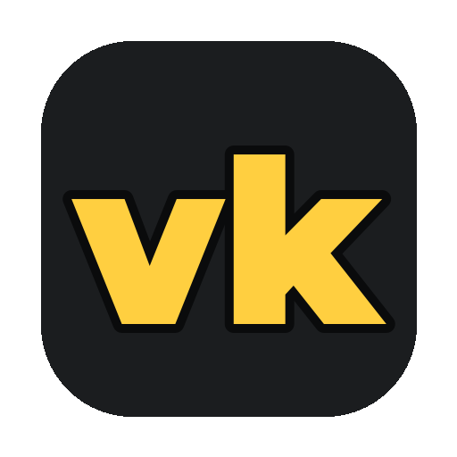

<p align="center"></p>

# vlogkit kurulumu

İki adım: Terminal'de bir satır Stüdyo'yu kurar, kalanını Stüdyo'nun kurulum ekranından tıklayarak kurarsın.

**Gerekenler:** Apple Silicon bir Mac (M1 ve sonrası), macOS 14 ya da sonrası, yönetici hesabı ve Claude Pro / Max ya da ChatGPT Plus / Pro aboneliği.

## 1. Stüdyo'yu kur (1-2 dakika, ~150 MB)

1. **Terminal**'i aç: ⌘ + boşluk, "Terminal" yaz, Enter.
2. Bu satırı yapıştır ve Enter'a bas:

   ```bash
   /bin/bash -c "$(curl -fsSL https://raw.githubusercontent.com/abdulkadirerdem/vlogkit-studio/main/install.sh)"
   ```

Bu adım yalnız Stüdyo'yu kurar (vlogkit, Python ortamı ve uv), masaüstüne **vlogkit Stüdyo** uygulamasını koyar ve Stüdyo'yu tarayıcıda açar. Şifre sormaz.

## 2. Kurulum ekranından kalanları kur

Stüdyo ilk açıldığında kurulum ekranı çıkar. Her satırda ne olduğu ve boyutu yazar:

| Adım | Boyut | Nasıl |
|---|---|---|
| Apple geliştirici araçları ve Homebrew | ~2 GB | **Terminal'de kur**: Mac şifren sorulur (yazarken görünmez). "Command Line Tools" penceresi açılırsa **Yükle**. |
| Video ve ses araçları (ffmpeg, whisper, aubio) | ~1,5 GB | **Kur**: arka planda, ilerlemesiyle |
| Konuşma modeli | 1,5 GB | **İndir** |
| Müzik ve ses kütüphanesi | ~90 MB | **İndir** |
| Yapay zekâ ajanı: Claude Code ya da Codex | ~0,2 GB | **Kur**, sonra **Giriş yap**: Terminal ve tarayıcı açılır, hesabınla onayla |

İlk satırdan sonra **Hepsini kur** kalanları sırayla kurar. Hepsi bitince ekran "Hazır" der. Sonraki seferlerde masaüstündeki **vlogkit Stüdyo**'ya çift tıklaman yeter.

## Kullanım

- Videolarını `~/yt-vlogs` içine koy (ör. `~/yt-vlogs/tatil/ham/`). Stüdyo'da **Video** ile seç ya da pencereye sürükle.
- Ne istediğini yaz: "Bu klasördeki ham çekimlerden 40 saniyelik bir Short yap". **Görev** menüsünde hazır istekler var.
- Kurgu bitince video Stüdyo'da oynar. Altındaki plan şeridinden bir anı seçip yorum yaz; düzeltmeyi ajan yapar.
- Kullanılan müziklerin lisansı videonun yanındaki `.lisans.md` dosyasında ve sağ üstteki **Lisanslar** kartında. Platform telif talebi gönderirse oradaki itiraz metnini kullan.

## İsteğe bağlı: yerel video modeli

Sol alttaki **Ayarlar** > **Yerel model**. Ham çekimi parça parça izleyip ajanın doğru anı bulmasına yardım eder; kurulu olmasa da her şey çalışır. Mac'inin belleğine uymayan model kurulamaz; uygun olanın yanında **önerilen** yazar:

| Model | Disk | En az bellek |
|---|---|---|
| Qwen3.5 2B | ~2,4 GB | 8 GB |
| Qwen3.5 4B | ~3,7 GB | 16 GB |
| Qwen3.5 9B | ~6,6 GB | 16 GB (24 GB'tan önerilen) |

## Güncellemeler

Stüdyo açıkken saatte bir yeni sürüme bakar; çıkınca sol altta **Güncelleme var** yazar. Tıkla, yeniliklere bak, **Güncelle**. Stüdyo kendini yeniden açar; projelerin, videoların ve ayarların değişmez. Bir iş çalışırken güncelleme yapılmaz.

## Sorun çıkarsa

- **Stüdyo açılmıyor:** Terminal'de `cd ~/yt-vlogs/vlogkit && uv run vlogkit open`. Günlük: `~/yt-vlogs/vlogkit/build/ui/server.log`.
- **Neyin eksik olduğunu gör:** `cd ~/yt-vlogs/vlogkit && uv run vlogkit doctor`.
- **Masaüstü uygulaması eski ikonla duruyor ya da yenilenemedi:** macOS onu korur; çöpe at ve kurulum satırını tekrar çalıştır.
- **Bir adım yarıda kaldı:** Kurulum ekranında aynı düğmeye tekrar bas; ilk satır için kurulum komutunu tekrar çalıştırmak da güvenli.
- **Disk doluyor:** **Ayarlar** > **Depolama** > Ara dosyalar eski derlemelerin büyük ara dosyalarını siler; teslim videoların kalır.

## Kaldırma

**Ayarlar** > **Sürüm ve kaldırma**:

- **Uygulamayı kaldır:** vlogkit'i ve masaüstü uygulamasını siler.
- **Uygulamayı ve kurulan paketleri kaldır:** ayrıca video araçlarını, konuşma modelini ve yerel video modellerini siler.

Önce silinecekler boyutlarıyla listelenir. Videoların ve teslim dosyaların kalır; projelerin ve iş geçmişin `~/yt-vlogs/vlogkit-yedek-<tarih>` klasörüne yedeklenir. Homebrew, Apple geliştirici araçları ve Claude Code / Codex başka uygulamalar da kullanabileceği için kalır.

## Lisans

Haklar geliştiricisine aittir ([LICENSE](LICENSE)). Kendi videolarını yapıp yayınlamak için, para kazanan kanallarda da serbestçe kullanabilirsin. Yazılımı satmak, ücretli hizmet olarak sunmak ya da ticari bir ürüne katmak için yazılı izin gerekir.
