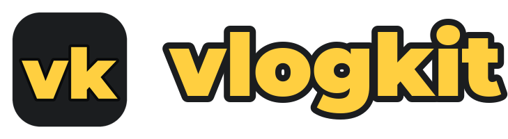
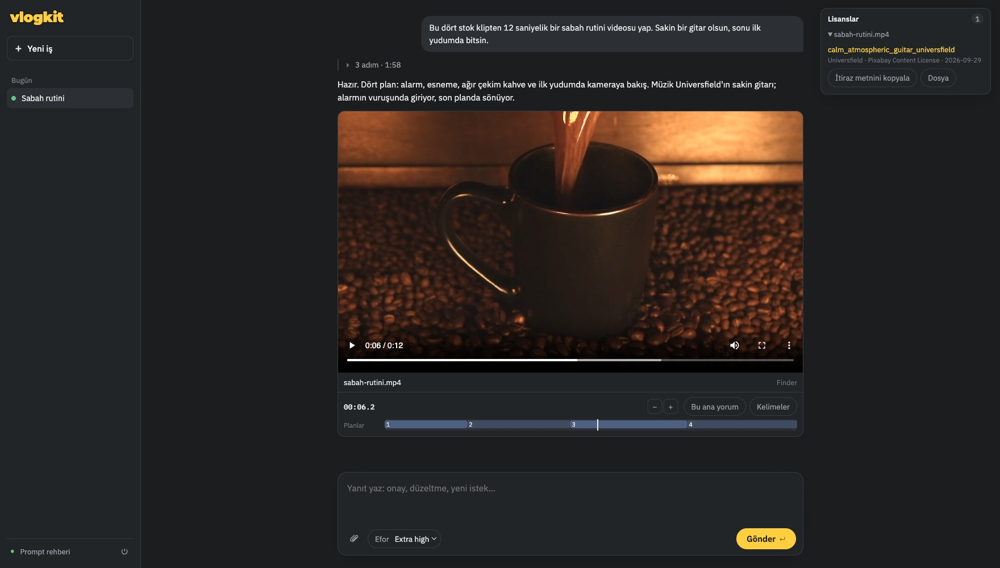

<p align="center">
  
</p>

<p align="center">
  <b>Ne istediğini yaz, kurguyu yapay zekâ yapsın.</b><br>
  Claude Code ya da Codex ile kendi Mac'inde video kurgusu: ham çekimden Short'a, Reels'e, uzun videoya.
</p>

<p align="center">
  
</p>

## Kurulum

Terminal'i aç (⌘ + boşluk, "Terminal" yaz), bu satırı yapıştır ve Enter'a bas:

```bash
/bin/bash -c "$(curl -fsSL https://raw.githubusercontent.com/abdulkadirerdem/vlogkit-studio/main/install.sh)"
```

Bu satır yalnız Stüdyo'yu kurar (~150 MB, bir iki dakika, şifre sormaz) ve tarayıcıda açar. Video araçları, konuşma modeli, müzik kütüphanesi ve yapay zekâ ajanı Stüdyo'nun kurulum ekranından, boyutları görünerek tek tıkla kurulur. Adım adım anlatım: **[KURULUM.md](KURULUM.md)**.

Gerekenler:
- Apple Silicon bir Mac (M1 ve sonrası), macOS 14 ya da sonrası
- Claude Pro / Max ya da ChatGPT Plus / Pro aboneliği (kurgu bu abonelikle yapılır, ayrıca ücret yok)

## Neler yapar

- Ham klasörünü izler, iyi anları bulur; Short, Reels ya da uzun video kurgular.
- Altyazı, kanca başlığı, renk, ses seviyesi, müzik ve efekt ekler, teslimden önce kendi kurgusunu denetler.
- Telifsiz müzik adaylarını sahnenin altında dinletir; seçimi sen yaparsın.
- Videonun altındaki plan şeridinden bir anı seçip yorum yazarsın, düzeltmeyi ajan yapar.
- Her videonun yanına kullandığı müziklerin lisansını ve telif itiraz metnini koyar.

Videoların bilgisayarından çıkmaz: aboneliğindeki yapay zekâya yalnız yazdıkların, ajanın baktığı kareler ve konuşma dökümleri gider.

## Bilgisayarına neler kurulur

| Parça | Ne işe yarar | Disk | Nereden |
|---|---|---|---|
| vlogkit, Python ortamı, uv | Stüdyo'nun kendisi | ~0,15 GB | Terminal'deki satır |
| Apple geliştirici araçları ve Homebrew | git, derleyici, paket yöneticisi (birçok Mac'te zaten var) | ~2 GB | Kurulum ekranı |
| ffmpeg, whisper, aubio | video, konuşma ve müzik araçları (bağımlılıklarıyla ~115 paket) | ~1,5 GB | Kurulum ekranı |
| Konuşma modeli (whisper large-v3-turbo) | konuşmayı internetsiz yazıya döker | 1,5 GB | Kurulum ekranı |
| Müzik ve ses kütüphanesi | lisanslı müzik ve efektler | ~0,1 GB | Kurulum ekranı |
| Claude Code ya da Codex | kurguyu yapan ajan | ~0,2 GB | Kurulum ekranı |
| **Toplam** | | **~5,5 GB** | (geliştirici araçları varsa ~3,5 GB) |

İsteğe bağlı **yerel video modeli** (ham çekimi parça parça izler; Ayarlar'dan kurulur): Qwen3.5 2B ~2,4 GB, 4B ~3,7 GB, 9B ~6,6 GB.

**Çalışırken:** Yapay zekâ bulutta, aboneliğinle çalışır; bilgisayarını yoran kısım video derlemesidir. Derleme sırasında işlemci ve ekran kartı tam yükte çalışır ve büyük ara dosyalar yazılır (4K'da 4 dakikalık bir video için ~30 GB). Ayarlar > **Ara dosyalar** eskilerini siler. Bellek: Stüdyo ~0,2 GB, konuşma tanıma ~2 GB, yerel model 3-10 GB (boyutuna göre).

## Güncelleme

Yeni sürüm çıkınca Stüdyo'nun sol altında **Güncelleme var** yazar; tek tıkla güncellenir. Projelerin, videoların ve ayarların değişmez.

## Lisans

© Abdulkadir Erdem. [PolyForm Noncommercial 1.0.0](LICENSE) ve ek izin: kendi videolarını yapıp yayınlamak serbest, para kazanan kanallar dahil. Yazılımı satmak, ücretli hizmet olarak sunmak ya da ticari bir ürüne katmak yazılı izin ister.
